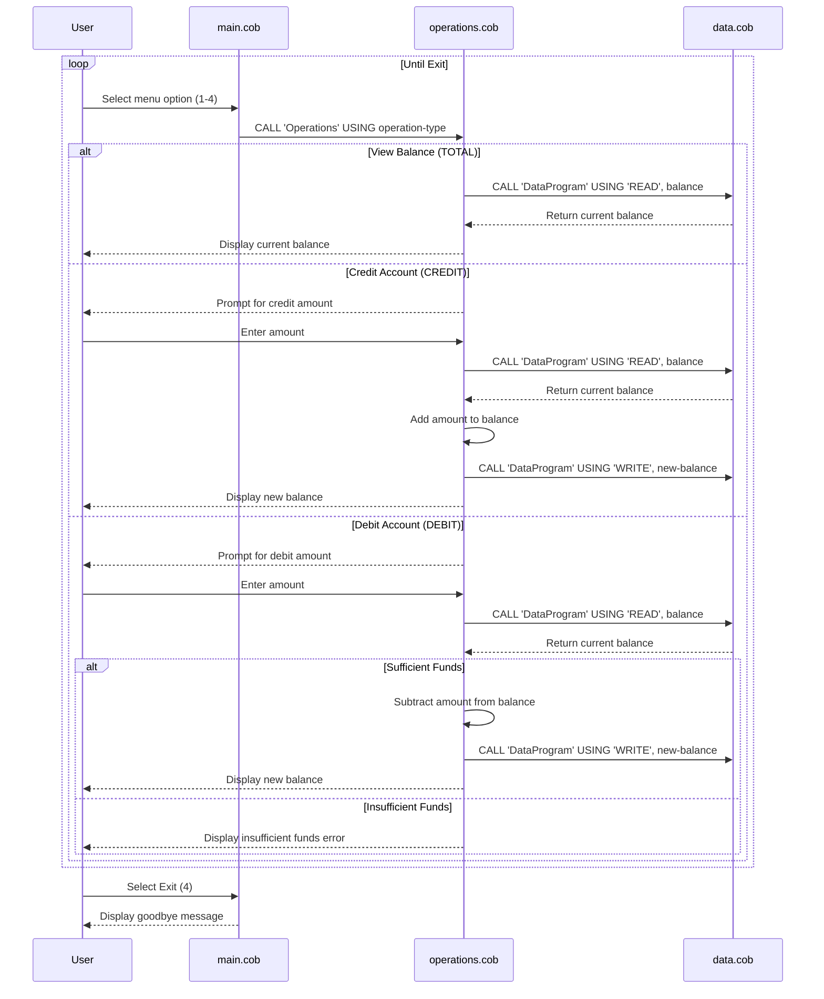

# COBOL Student Account Management System

This project contains a legacy COBOL-based system for managing student accounts. The system allows users to view account balances, credit accounts, and debit accounts with basic validation.

## COBOL Files Overview

### data.cob
**Purpose:** Handles data persistence for account balances.

**Key Functions:**
- Stores the current account balance in working storage
- Provides read/write operations for balance data
- Acts as a simple data layer for the account management system

**Business Rules:**
- Initial balance is set to $1000.00
- Supports two operations: 'READ' to retrieve balance and 'WRITE' to update balance

### main.cob
**Purpose:** Main entry point and user interface for the account management system.

**Key Functions:**
- Displays a menu-driven interface
- Handles user input for account operations
- Calls the Operations program for processing different account actions
- Manages program flow and exit conditions

**Business Rules:**
- Provides four menu options: View Balance (1), Credit Account (2), Debit Account (3), Exit (4)
- Validates user input and handles invalid choices
- Continues running until user chooses to exit

### operations.cob
**Purpose:** Implements the core business logic for account operations.

**Key Functions:**
- Processes credit operations (adding money to account)
- Processes debit operations (subtracting money from account)
- Handles balance inquiries
- Validates debit transactions against available funds

**Business Rules:**
- **Debit Validation:** Debit operations are only allowed if the account has sufficient funds
- **Credit Operations:** Credits can be any positive amount
- **Balance Display:** Shows current balance for inquiry operations
- **Insufficient Funds Handling:** Displays error message when attempting to debit more than available balance

## System Architecture

The system follows a modular design with three main components:
1. **Main Program (main.cob):** User interface and program control
2. **Operations Module (operations.cob):** Business logic and transaction processing
3. **Data Module (data.cob):** Data storage and retrieval

All modules communicate through COBOL CALL statements and linkage sections, demonstrating traditional mainframe-style program structure.

## Sequence Diagram

